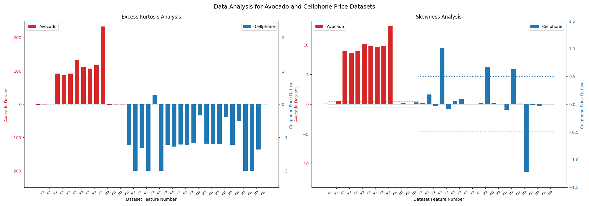

# Hey ML, what can you do for me?
## Authors
- [Javier Pastorino](https://cse.ucdenver.edu/~pastorij)
- [Ashis K. Biswas](https://cse.ucdenver.edu/~biswasa)

[Machine Learning Lab](http://ml.cse.ucdenver.edu) - University of Colorado, Denver

## Abstract
Machine learning (ML) algorithms are data-driven and given a goal task and a prior experience dataset relevant to the task, one can attempt to solve the task using ML seeking to achieve high accuracy. There is usually a big gap in the understanding between an ML experts and the dataset providers due to limited expertise in cross disciplines. Narrowing down a suitable set of problems to solve using ML is possibly the most ambiguous yet important agenda for data providers to consider before initiating collaborations with ML experts. We proposed an ML-fueled pipeline to identify potential problems (i.e., the tasks) so data providers can, with ease, explore potential problem areas to investigate with ML. The autonomous pipeline integrates information theory and graph-based unsupervised learning paradigms in order to generate a ranked retrieval of top- k problems for the given dataset for a successful ML based collaboration. We conducted experiments on diverse real-world and well-known datasets, and from a supervised learning standpoint, the proposed pipeline achieved 72% top-5 task retrieval accuracy on an average, which surpasses the retrieval performance for the same paradigm using the popular exploratory data analysis tools.

## Requirements
- We developed the proposed solution and executed our experiments using Python 3.8 in both Mac OsX and Ubuntu 18. 
- The required packages to run the code are listed in [requirements.txt](code/src/requirements.txt)

### Program Descriptions
- [heyml.py](code/src/heyml.py): is the Hey Ml black box. Allows the user to select the `.csv` files from the `data` repository.
- [total_correlation.py](code/src/total_correlation.py): similar to Hey Ml but using only the Total Correlation Metric to generate the ranking
    - *Watanabe S., “Information Theoretical Analysis of Multivariate Correlation,” IBM Journal of Research and Development, vol. 4, no. 1, pp. 66–82, 4 2010.*

## UCI Datasets:
The following are the datasets used from the UCI Machine Learning Repository.
- **Abalone:** *Nash W., Sellers T.L., Talbot S.R., Cawthorn A.J., and Ford W.B. 1994. The population biology of Abalone (Haliotis species) in Tasmania. I. Blacklip abalone (H rubra) from the North Coast and the Islands of Bass Strait. Sea Fisheries Division Marine Research Laboratories - Taroona Dept.of Primary Industry and Fisheries Tasmania. 69pages. http://trove.nla.gov.au/work/11326142?selectedversion= NBD10642215*
    - [Download Link](https://archive.ics.uci.edu/ml/machine-learning-databases/abalone/)
- **Automobile MPG:** *Quinlan J.R. 1993. Combining Instance-Based and Model-Based Learning. In Proceedings of the Tenth International Conference on International Conference on Machine Learning (ICML’93). Morgan Kaufmann Publishers Inc., San Francisco, CA, USA, 236–243.*
    - [Download Link](https://archive.ics.uci.edu/ml/machine-learning-databases/auto-mpg/)
- **Bike Sharing:** *Fanaee-T H. and Gama J. 2014. Event labeling combining ensemble detectors and background knowledge. Progress in Artificial Intelligence 2,2-3 (11 2014), 113–127. https://doi.org/10.1007/s13748-013-0040-3*
    - [Download Link](https://archive.ics.uci.edu/ml/machine-learning-databases/00275/)
- **Condition Based Maintenance of *Naval* Propulsion Plants:** *Coraddu A., Oneto L., Ghio A., Savio S., Anguita D., and Figari M. 2014. Machine Learning Approaches for Improving Condition?Based Maintenance of Naval Propulsion Plants. Journal of Engineering for the Maritime Environment (2014)*
    - [Download Link](https://archive.ics.uci.edu/ml/machine-learning-databases/00316/)
- **Iris:** *Fisher R.A. 1936. The Use of Multiple Measurements in Taxonomic Problems. Annals of Eugenics 7, 2 (9 1936), 179–188. https://doi.org/10.1111/j. 1469- 1809.1936.tb02137.x*
    - [Download Link](https://archive.ics.uci.edu/ml/machine-learning-databases/iris/)
- **Superconductivity:** *Hamidieh K. 2018. A data-driven statistical model for predicting the critical temperature of a superconductor. Computational Materials Science 154 (11 2018), 346–354. https://doi.org/10.1016/j.commatsci.2018.07.052*
    - [Download] (https://archive.ics.uci.edu/ml/machine-learning-databases/00464/)
- **Yacht Hydrodynamics:** *Gerritsma J., Onnink R., and Versluis A. 1981.Geometry, Resistance and Stability of the Delft Systematic Yacht Hull Series. International Shipbuilding Progress 28, 328 (1981), 276–286. https://doi.org/10.3233/ISP-1981-2832801*
    - [Download Link](https://archive.ics.uci.edu/ml/machine-learning-databases/00243/)
- **Wine Quality:** *Cortez P., Cerdeira A., Almeida F., Matos T., and Reis J. 2009. Modeling wine preferences by data mining from physico-
chemical properties. Decision Support Systems 47, 4 (11 2009), 547–553. https://doi.org/10.1016/j.dss.2009.05.016*
    - [Download Link](https://archive.ics.uci.edu/ml/machine-learning-databases/wine-quality/)

## Real-World Datasets Distribution Analysis
We used two "real-world" datasets extracted from Kaggle: *Avocado* dataset and *Cellphone price* dataset.
Below is the report of the data analysis we conducted during our experiments.

### Analysis Detailed Report
- [Avocado](dataset_analysis/avocado.analysis.report.txt)
- [Cellphone Price](dataset_analysis/cellphone_price.analysis.report.txt)

### Kurtosis and Skewness Analysis

